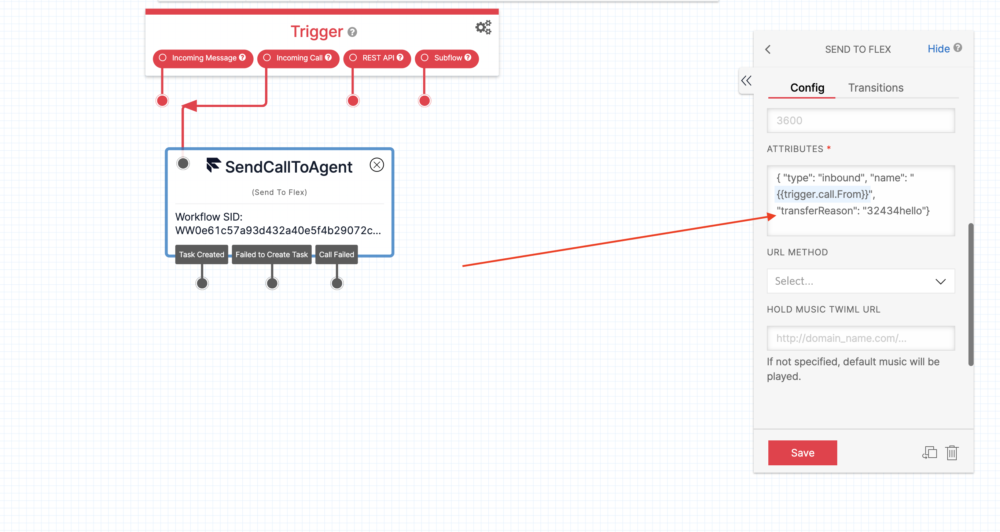
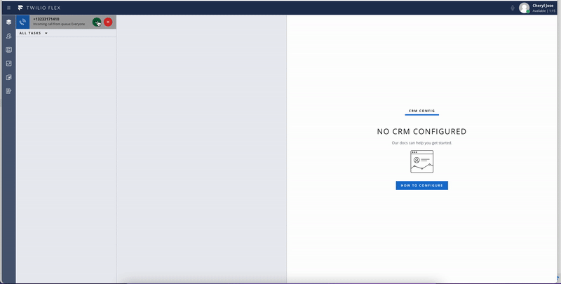

# Flex Plugin Setup

The following instructions illustrate a quick way to get this Flex plugin code up and running locally, so you can customize and test this code before deploying it to Twilio. These instructions also show how to do a simple deploy to Twilio using the Twilio CLI. More in-depth instructions for building, running, and deploying Flex Plugins can be found in the [Flex Plugins documentation](https://www.twilio.com/docs/flex/developer/plugins). An example of the topics covered are:

- [Running multiple Flex Plugins locally](https://www.twilio.com/docs/flex/developer/plugins/cli/run-multiple-plugins)
- [Using the CLI to programmatically deploy Flex Plugins to Twilio](https://www.twilio.com/docs/flex/developer/plugins/cli/deploy-and-release)
- [Use the Flex Plugins Dashboard](https://www.twilio.com/docs/flex/developer/plugins/dashboard)

## Requirements

- An active Twilio Flex account
- A command line tool like Terminal or iTerm
- [Node.js and npm](https://nodejs.org/en/) (npm is installed with Node)

  - A slightly more elegant solution to installing Node.js is by using [Node Version Manager or nvm](https://github.com/nvm-sh/nvm). This is optional, but many developers prefer the ability to control versions of Node.js from project to project.

- [The Twilio CLI](https://www.twilio.com/docs/twilio-cli/quickstart)

- The [Flex Plugin extension](https://www.twilio.com/docs/twilio-cli/plugins#available-plugins) to the Twilio CLI

> **Important Note:** If this Flex Plugin requires the use of [Twilio Serverless Functions](https://www.twilio.com/docs/runtime/functions), then be sure to have your [Node.js version set to 14](https://www.twilio.com/docs/runtime/runtime-node-upgrade) within the Serverless Functions directy in your code. This is where using nvm would come in handy as you can set the Node.js version to 14 in an [.nvmrc file](https://github.com/nvm-sh/nvm#nvmrc) in the Serverless Functions directory and set the Node.js version running React/Twilio Flex to a different version.

### A Note About Twilio CLI for Flex

The Twilio CLI is required in the following steps to run and install this plugin. Be sure you are working within the correct profile in your CLI before you deploy code. Each CLI profile is associated with a specific Twilio accounts, so you don't want to mistakenly push code to the wrong Twilio account. Review the [CLI General Usage](https://www.twilio.com/docs/twilio-cli/general-usage) documentation for further details about CLI profiles.

#### CLI General Use

**Create a CLI Profile**
From command line run: `twilio login`
Follow the prompts to finish creating a profile.

**List CLI Profiles**
From command line run: `twilio profiles:list`

**Usa a CLI Profile**
From commandline run: `twilio profiles:use PROFILE_NAME`

## Twilio Flex Plugin - Custom information populated in Task Info Panel

This plugin will update the Task Info panel with information that retrieved from Studio

## Step 1: Download Plugin Code

> :information_source: If you've used the Twilio CLI to create a Flex Plugin from scratch, you can skip Step 1.

Download or clone this code repository to your local development environment.

GitHub provides several options for downloading this source code:

- Use the [GitHub desktop](https://desktop.github.com/) application
- Clone the code via [HTTPS, SSH, or GitHub CLI](https://github.com/cherylmj01/plugin-custom-info-tab.git)
- Download a zip file of this code.

## Step 2: Install Dependencies

1. Once the plugin code has been downloaded to your development environment, open a Command Line interface and `cd` into the root code directory.
2. Once in the root plugin code directory run the following in Command Line: `npm install` or `npm i`
3. All of the code dependencies are installed and you may now start building and running your code locally.

## Step 3: Run Plugin Locally

1. This plugin can be run locally in your default browser by running the following in Command Line: `twilio flex:plugins:start`
2. You will be prompted to login. At this point you can select to use your Twilio login to log into Flex.
3. Once logged into Flex you will see that Flex will be running on `localhost:3000` in your browser.

## Step 4: Deploy and Release Plugin to Twilio

The `twilio flex:plugins:deploy` command automates the process of uploading your plugin to Flex. This allows you to deploy your plugins via the command line, without needing to manually upload them using a GUI. After a deploy, your plugin is not yet enabled for all your users on your Flex application. You need to run the `release` command after the deploy to enable any changes.

The `twilio flex:plugins:release` command is used to change which plugins are live for your users. You can group multiple plugins into a release, and you can re-activate any prior release to rollback changes.

See the [Deploy and Release documentation](https://www.twilio.com/docs/flex/developer/plugins/cli/deploy-and-release) for full detailed instructions.

The `twilio flex:plugins:release` command is used to change which plugins are live for your users. You can group multiple plugins into a release, and you can re-activate any prior release to rollback changes.

See the [Deploy and Release documentation](https://www.twilio.com/docs/flex/developer/plugins/cli/deploy-and-release) for full detailed instructions.

## How this plugin works ?

This plugin will retrieve information from the studio flow and display it in the info tab of the selected task.

As an example here, we have defined an attribute `test` within the studio for the voice flow and populated this attribute with some value that we wish to populate on the info tab of the task. Please see the below screenshot for reference :

To accomplish the goal here, we have created a component in the file `TaskInfo.js`.

This component is able to retrieve the information for the task using the withTaskContext() helper function.

The withTaskContext() adds data about the selected Task to our component and more information on this can be found [here](https://www.twilio.com/docs/flex/developer/ui/add-component-context).

When the information is retrieved on the info tab, it would be populated on the top part of the info tab as shown below :

